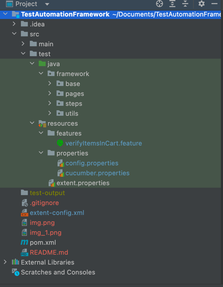

    # Cucumber-BDD-Automation-Framework

This is normal behaviour driven framework built using cucumber,selenium,webdriver manager and other required libraries.

Directory structure:

Steps to run at your system:
Clone the repository using `git clone https://github.com/grv1mehta/test-bdd-selenium.git`

Run `mvn clean test`
Or
Run the TestRunner under base/framework
Or 
Run the feature file/scenario directly

Cucumber Reports:

Reports folder - "target\cucumber-reports\Report.html)

Please refer the recording for the scenario run at root folder by the name of: Screen Recording 2022-08-09 at 13.14.06.mov